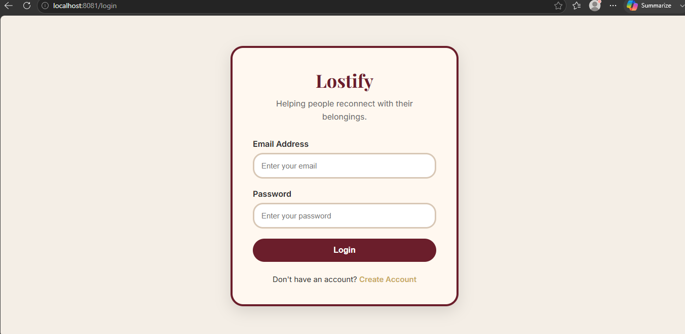
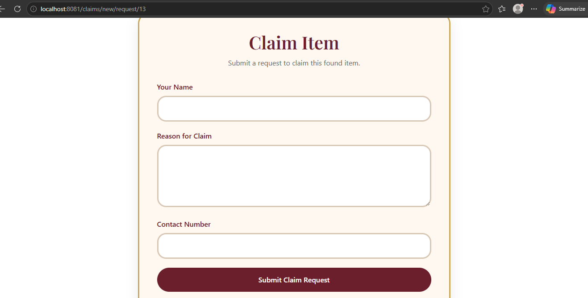

# 🧳 Lost & Found Portal

A full-stack Spring Boot web application that helps users report, search, and claim lost and found items.

---

## 🚀 Features

- User Registration & Login (Spring Security)
- BCrypt password encryption
- Report Lost Items
- Report Found Items
- Image upload for items
- Claim request system for found items
- View and manage personal posts
- Search items by name
- Filter by Lost / Found status
- Edit and delete posts
- MySQL database integration
- Clean and responsive UI using Bootstrap + custom CSS

---

## 🛠️ Tech Stack

- Java 17+
- Spring Boot
- Spring MVC
- Spring Security
- Spring Data JPA
- Thymeleaf
- MySQL
- HTML, CSS, Bootstrap

---
## 📸 Screenshots

### 🔐 Login Page

### 🏠 Dashboard

### ➕ Add Lost Item

### 📦 My Posts

### 👀 View Claims

